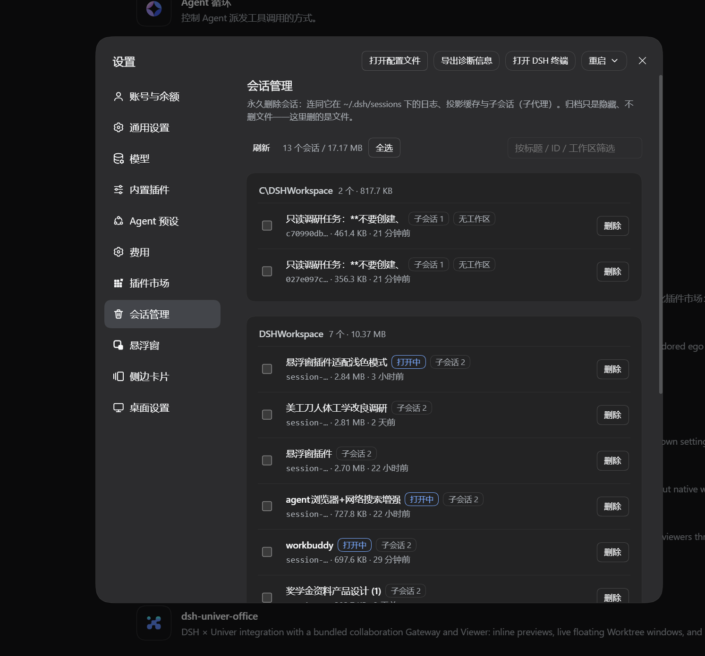
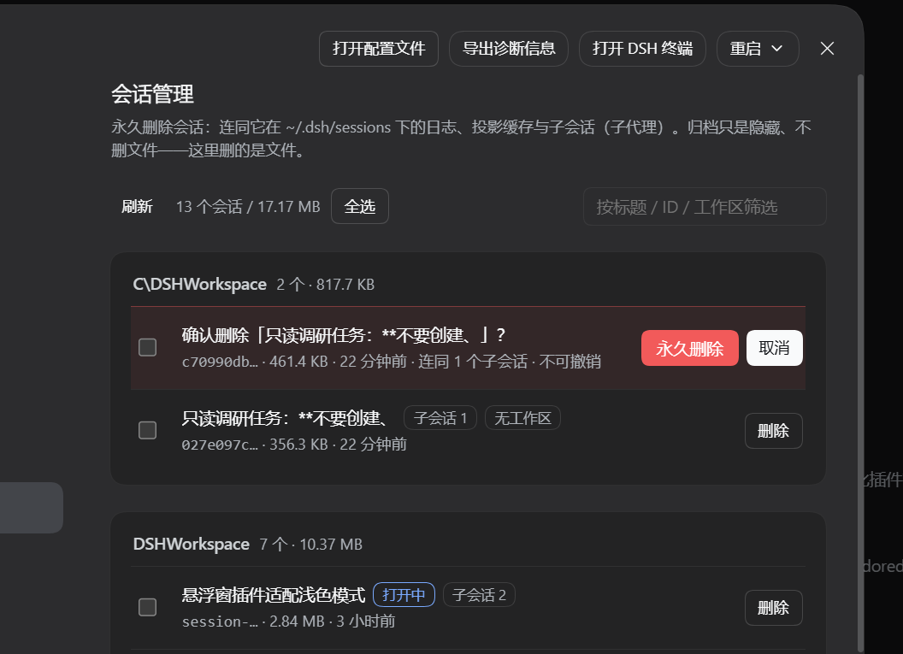
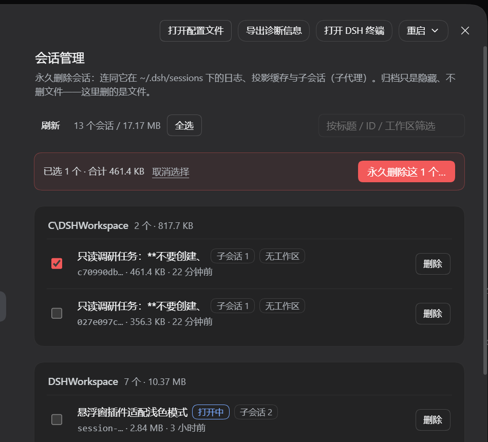

<div align="center">

# dsh-plugin-session-purge

**DSH 会话管理：真正把会话删掉，而不是藏起来。**

永久删除会话，连同它的日志、投影缓存、工作区记账与子会话（子代理）一起清干净。

[](./LICENSE)
[](./CHANGELOG.md)
[](https://github.com/topics/dsh-plugin)
[](#兼容性)
[](https://awesome-dsh-plugin.com)

[简体中文](./README.md) · [安装](#安装) · [使用](#使用) · [FAQ](#faq)

</div>

---

## 项目简介

DSH（DeepSeek Harness）自带的「归档」只是把会话从列表里**隐藏**，磁盘上的日志目录和投影缓存一个字节都不动。
`dsh-plugin-session-purge` 补上的就是缺失的那一步：**真删**。

它从两个地方给你入口——设置页与对话头部按钮——并且会顺着会话的关联数据一路清下去：
磁盘上的日志目录、投影缓存文件、工作区记账（`workspaceRegistry`）以及该会话派生的子会话（子代理）。

> [!WARNING]
> **删除不可恢复。** 本插件不提供回收站、不做二次备份、也无法撤销。
> 被删会话的对话记录、工具调用记录与子代理记录会一并从磁盘消失。
> 重要会话请先导出，详见 [风险提示](#风险提示)。

## 效果截图

**设置页入口**——`设置 → 会话管理`，按工作区分组，每行带状态标记（`打开中` / `子会话 N` / `无工作区`）：



**删除前的内联二次确认**——确认块展开在**下方独立区块**，红色「永久删除」与白色「取消」在两端，
被删对象是哪一个、多大、多久没动过、连不连带子会话，都在这一行里写清楚：



**批量删除**——勾选后底部出现选择条，显示已选数量与合计体积：



## 核心特性

- **两个入口** —— 设置页 `设置 → 会话管理`，以及对话头部的删除按钮。
- **永久删除，不是归档** —— 直接移除磁盘上的会话目录与投影缓存，释放的空间是真实的。
- **级联清理** —— 一次删除同时处理四类关联数据：

  | 关联数据 | 磁盘位置 | 处理方式 |
  |---|---|---|
  | 会话日志 | `~/.dsh/sessions/<工作区文件夹>/<会话ID>/` | 递归删除整个目录 |
  | 投影缓存 | `~/.dsh/storages/session_projcache/sessions/<会话ID>.json` | 删除文件 |
  | 工作区记账 | `~/.dsh/storages/workspace.json` 的 `tables.workspaces[*].sessionIds` 与 `global.archivedSessionIds` | 解除归属 |
  | 子会话（子代理） | 同工作区文件夹下的子代理会话 | 可选一并删除 |

- **子会话判定保守** —— 「子会话」= 与父会话在**同一个 workspace 文件夹**下、且**不在任何 workspace 的 `sessionIds` 里**的会话。
  这条规则保证**绝不会误删别的正常会话**。
- **列表信息完整** —— 每一行给出标题、会话 ID（截断显示）、占用体积、目录最后修改时间，以及 `打开中` / `已归档` / `子会话 N` / `无工作区` 四种状态标记。
- **按工作区分组** —— 同一工作区的会话归入一张卡片，卡片头显示数量与合计体积，卡内按体积从大到小排列。
- **可筛选** —— 顶部筛选框按标题 / 会话 ID / 工作区名过滤。
- **批量删除** —— 勾选多个会话一次性删除；「全选」在筛选状态下只选中筛选结果。
- **已归档一键清理** —— 独立的危险卡片「删除全部已归档会话」，带自己的确认步骤。
- **误触防护** —— 删除是一次普通的描边按钮，确认块出现在**下方独立区块**：
  取消按钮是白色主按钮、占了指针刚停留的位置，删除是整页唯一的红色按钮，两者之间隔着一整段空白。
- **渲染隔离** —— 整个面板包在 React error boundary 内；插件渲染出错也**绝不会**外溢到设置面板的其他分区。
- **跟随官方设计系统** —— 普通按钮用官方 `@deepseek-ai/dsh-client-ui-primitives` 的 `Button`，颜色一律走 `--dsw-alias-*` CSS 变量，浅色 / 深色主题自动适配。
- **无构建步骤** —— 浏览器半边是手写的 DSH 客户端模块（`window.__ModuleLoader__.load`），纯 JS，装上即用。

## 兼容性

| 项目 | 值 |
|---|---|
| 插件包名 | `dsh-plugin-session-purge` |
| 当前版本 | `1.0.0` |
| 插件类型 | Plugin（host + browser 两半） |
| Client 平台 | `web` |
| 依赖的 DSH 能力 | `webServer`、`slots`（均为主机 / 客户端内置服务，非外部依赖） |
| 运行时依赖 | **无**（`package.json` 未声明任何 `dependencies` / `peerDependencies`） |
| 官方 `@deepseek-ai/*` 依赖 | **无**（`lib/client.js` 通过 `require()` 取 `react` 与 `@deepseek-ai/dsh-client-ui-primitives`，由 DSH 宿主自身提供，故不写入 `package.json`） |
| License | MIT |

**实测环境**（开发与验证均在此环境完成）：

| 项目 | 值 |
|---|---|
| 宿主程序 | **DSH Desktop 2.0.15** |
| 活动 profile | `desktop`（`patchReload: live`） |
| 操作系统 | Windows 11（26100） |
| 安装方式 | `link:` 本地链接安装 |

> **兼容性声明的现状（如实说明）**：`package.json` 目前**没有** `dsh.compatibility` 字段，
> 因此**没有以机器可读的形式声明**支持的 DSH 版本区间。上表是**人工实测**的结论，范围仅限 DSH Desktop 2.0.15。
>
> 需要补上时，字段形如 `dsh.compatibility.{dsh, dshReleases}`，
> 取值请以你所处 DSH 版本里 `@deepseek-ai/dsh-*` 包的实际声明为准，
> 详见 [CONTRIBUTING.md](./CONTRIBUTING.md#兼容性声明)。
> **在 macOS / Linux 上尚未验证。**

## 安装

### 前置条件

- 已安装并可正常运行 DSH（Web 或 Desktop 均可）。
- Git（仅「从源码安装」方式需要）。

### 从源码安装

> [!IMPORTANT]
> **本仓库目前只包含发布材料（文档、模板、Release 说明）。**
> 插件源码（`plugin/`）尚未搬运进来，因此下面的命令**暂时还不能直接克隆安装**。
> 源码目录结构见 [CONTRIBUTING.md 的「代码结构」](./CONTRIBUTING.md#代码结构)。

```bash
# 1. 克隆
git clone https://github.com/cyh3436332528/dsh-plugin-session-purge.git
cd dsh-plugin-session-purge

# 2. 安装到目标 profile（此处以 desktop 为例）
dsh plugin --profile desktop add ./plugin

# 3. 重启 DSH
```

也可以让 DSH 直接从 GitHub 安装（免克隆）：

```bash
dsh plugin --profile desktop add github:cyh3436332528/dsh-plugin-session-purge
```

> 本插件**尚未发布到 npm**，因此没有 `dsh plugin --profile desktop add dsh-plugin-session-purge`
> 这种按包名安装的方式。
>
> 仓库里的 `plugin/` 是**无构建步骤的纯 JavaScript**（无 TypeScript、无 `prepare` 脚本），
> 所以从 git 源码安装**不需要** pnpm 的 `allowBuilds` 构建授权，安装后可直接加载。
> 已在本机实测：仓库内文件与开发目录 `plugin/` 内容一致。

### 卸载

```bash
dsh plugin --profile desktop remove dsh-plugin-session-purge
```

然后**重启 DSH**（理由同下）。

### ⚠️ 装完必须重启 DSH 一次

宿主半边运行在 DSH 的 Node 进程里。DSH 的宿主插件的 ESM 模块**按路径缓存**，
重装同一路径的插件不会重新加载——**必须重启 DSH**，宿主代码才会生效。
（浏览器半边 `client.js` 反而会随文件改动热重载。）

## 启用

重启后入口自动出现，无需任何配置：

- **设置页**：`设置 → 会话管理`，导航栏会显示一个垃圾桶图标。
- **对话头部**：会话标题栏上的删除按钮。

## 使用

### 设置页

1. 打开 `设置 → 会话管理`。面板会列出当前磁盘上的全部会话，按工作区分组。
2. （可选）在右上角筛选框输入标题 / 会话 ID / 工作区名来缩小范围。
3. 删除单个会话：点该行的 **删除** → 行内下方展开红色确认块，逐项列出「会话、ID、体积、时间、N 个子会话、是否正在打开」→ 点 **永久删除**。
4. 批量删除：勾选多个会话 → 底部出现选择条 → 点 **永久删除这 N 个…** → 确认块出现 → 点最终红色按钮。
5. 清理归档：页面下方的 **删除全部已归档会话** 卡片 → **永久删除…** → 确认。

删除完成后面板会提示实际删除了几项、释放了多少空间；如果有会话当时正开着，会单独说明。

### 关于「正在打开」的会话

若某个会话此刻正被 DSH 持有（面板上有 `打开中` 标记），行为如下：

- **文件照常删除**（日志与投影缓存立即从磁盘消失）；
- **工作区归属会保留**，避免该会话在侧栏里被踢进「未分组」；
- 因此它的**列表项要等 DSH 重启后才会消失**——面板会把它列在 `pending` 里明确告诉你。

这是刻意的取舍，不是 bug。详见下方 [已知限制](#已知限制)。

## 配置项

**本插件没有配置项。**

`package.json` 中 `dsh.client.inject` 为空数组，不读取任何 profile 配置，也不写入任何设置项。
所有行为（删除范围、确认步骤）都在界面上由你当场决定。

对「没有任何配置项」这件事有疑虑的话，可以在插件里搜 `ctx.settings`——**不存在**。

## 风险提示

> [!CAUTION]
> **删除是不可恢复的。**

1. **不进回收站。** 插件调用的是 `fs.rm(..., { recursive: true, force: true })`，直接抹掉文件系统上的数据，不经过任何回收站或废纸篓。
2. **会删什么。** 被删会话的对话记录、工具调用记录、上下文投影缓存、以及（勾选时）它的子代理会话记录，全部消失。
3. **同时影响多个位置。** 会话日志在工作区文件夹里，投影缓存在 `session_projcache` 里，记账在 `workspace.json` 里；三处都会被改动。
4. **可能被反复写到磁盘的缓存。** 会话相关的写入如果被 DSH 或其他工具缓存，删除后理论上可能被重建——本插件不做这类防护。
5. **建议先备份。** 删之前把 `~/.dsh/sessions/<工作区文件夹>/<会话ID>/` 整个目录复制出去。
   如只想留归档、不想真删，用 DSH 自带的归档功能即可，**不要用本插件**。

**删之前请确认：**

- [ ] 这个会话的内容我已经不需要了，也不需要事后回查。
- [ ] 它没有关联我正在追的上下文或未落盘的结论。
- [ ] 我勾选的「子会话」确实是该删的子代理，而不是别的正常会话。

## FAQ

**Q：它和 DSH 自带的「归档」有什么区别？**

归档只把会话从列表里隐藏起来，磁盘上的文件**一个都不删**。本插件删的是文件。

**Q：为什么删除后会话还在侧栏里？**

因为它此刻正被 DSH 打开着（`打开中`）。文件已经删了，但列表项要等 DSH 重启才会消失。
见 [关于「正在打开」的会话](#关于正在打开的会话)。

**Q：删掉的能找回吗？**

不能。见上方 [风险提示](#风险提示)。删之前请先备份目录。

**Q：会误删别的会话吗？**

不会。子会话的判定条件是「与父会话在**同一个 workspace 文件夹**下、且**不在任何 workspace 的 `sessionIds` 里**」。
其余会话不会被纳入本次删除范围。但请注意：**批量删除时你勾了谁就删谁**，勾选时请看清列表。

**Q：为什么「删除全部已归档会话」的卡片有时不出现？**

当没有任何已归档会话时，这张卡片不渲染。

**Q：它对界面有什么影响？会不会把设置面板搞坏？**

不会。面板整体包在 React error boundary 里，插件自身渲染失败只会显示一行提示文字，不会影响设置面板的其他分区。
按钮使用官方 UI primitives，配色走官方 CSS 变量，跟随浅色 / 深色主题。

**Q：删掉的空间去哪了？**

`workspace.json` 里的记账会被同步解除，所以 DSH 侧栏也不会再显示这些会话。
但请注意 DSH 进程自身对 `workspace.json` 的写入可能覆盖插件的外部修改。

**Q：支持哪些平台？**

开发与实测环境为 Windows + DSH Desktop。宿主代码使用纯 Node.js API（`node:fs` / `node:path` / `node:os`），
理论上跨平台可用，但**尚未在 macOS / Linux 上验证**。

**Q：为什么作者没有做「一键清空全部会话」？**

因为风险与收益不成比例。全部删除更容易误触，且大部分会话并没有占用多少空间。
请用筛选 + 全选，配合批量删除逐步进行。

## 已知限制

- **正在打开的会话无法立即从列表消失。** 会话的存活周期由创建它的 agent fiber 绑定，只要它还在内存里，列表项就还在。
  插件选择「删文件但保留工作区归属」，代价是列表项延后消失，收益是它不会被踢进「未分组」。
- **`package.json` 缺少 `dsh.compatibility` 声明。** 见 [兼容性](#兼容性) 的 TODO。
- **未做自动化测试。** 仓库内的 `_smoke.mjs` 是一个**只读**冒烟脚本，仅验证 `/list` 路由能返回数据。
  删除路径**没有**自动化测试覆盖。
- **`Delete-all-archived` 是逐条串行执行的**，会话数量很大时会较慢。

## 仓库结构

```
dsh-plugin-session-purge/
├── plugin/                    ← 插件本体（可直接被 dsh plugin add 安装的包）
│   ├── package.json           #   插件清单：dsh.bundle.patch + dsh.client
│   ├── cordis.patch.yml       #   bundle 层：往 profile 里插入一条 host 记录
│   ├── lib/
│   │   ├── index.js           #   宿主半边：HTTP 路由 + 扫描 + 删除实现
│   │   └── client.js          #   浏览器半边：设置页面板 + 导航图标
│   └── _smoke.mjs             #   只读冒烟脚本（不触发删除）
├── docs/
│   ├── assets/                #   效果截图
│   └── plugin-blurb.md        #   简介 / 关键词 / Topics / 徽章素材
├── release/
│   ├── v1.0.0-release-notes.md        # Release 说明、tag 方案、投稿文案
│   └── awesome-dsh-plugin-entry.yml   # 插件市场收录用的条目文件
└── .github/                   # Issue / PR 模板
```

两半的职责、HTTP 接口约定与开发注意事项见 [CONTRIBUTING.md](./CONTRIBUTING.md)。

## 参与贡献

见 [CONTRIBUTING.md](./CONTRIBUTING.md)。提交前请先读 [CODE_OF_CONDUCT.md](./CODE_OF_CONDUCT.md)。

## 致谢

- 感谢 DSH 团队把「一切皆插件」做成了现实。
- 目录结构、元数据字段与发布方式参考了社区已有插件（`dsh-better-sidebar`、`dsh-cost-meter`、`dsh-find-plugin`、`dshmarket`）。

## License

[MIT](./LICENSE) © dsh-plugin-session-purge contributors
